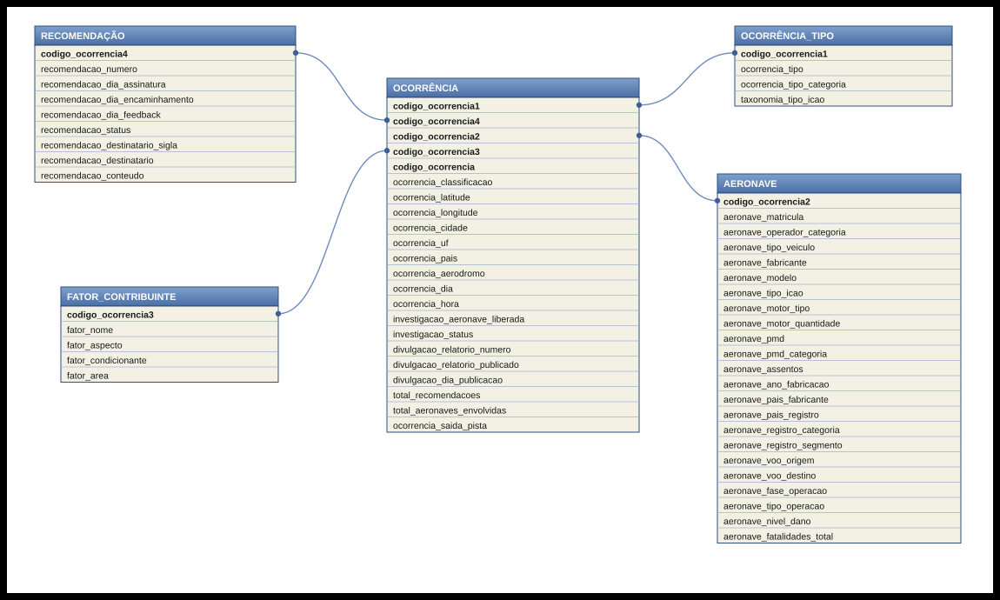
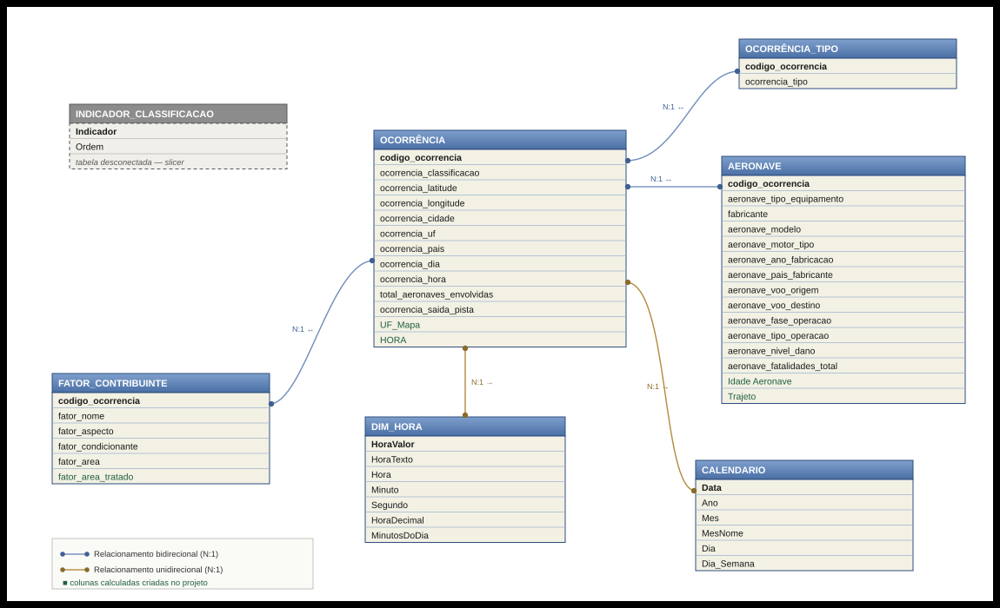
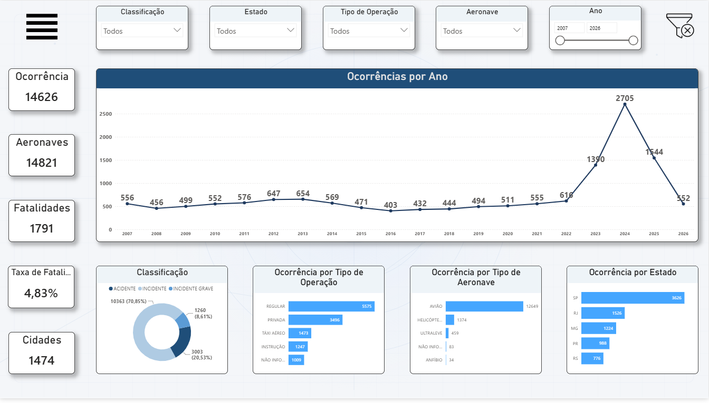
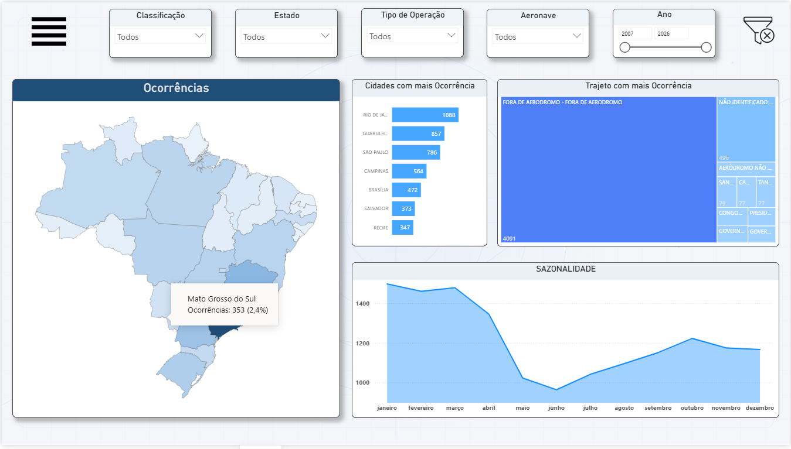
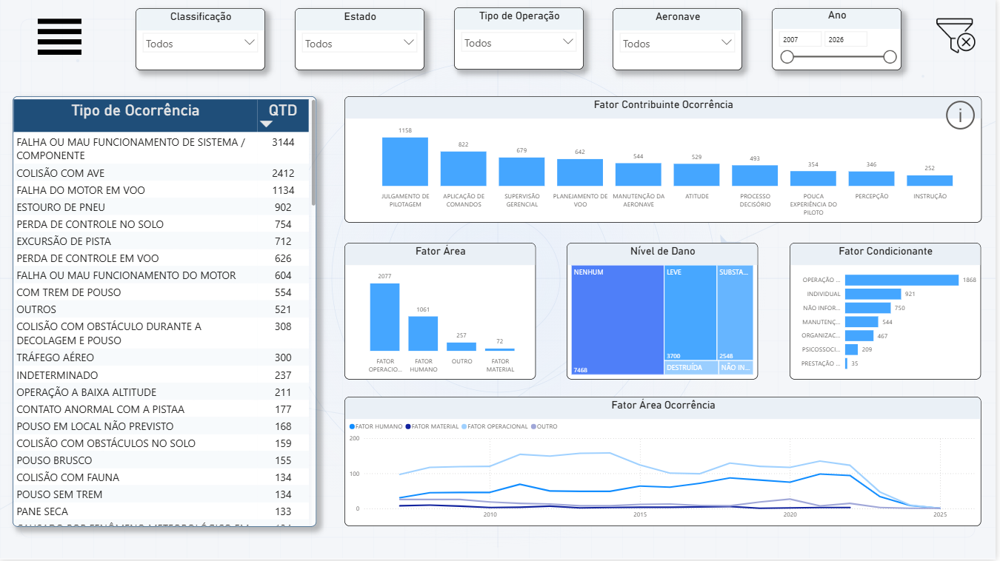
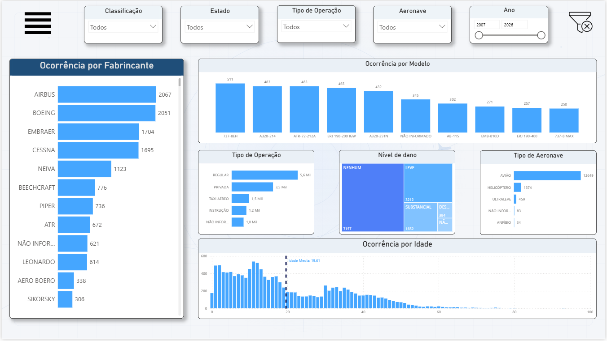
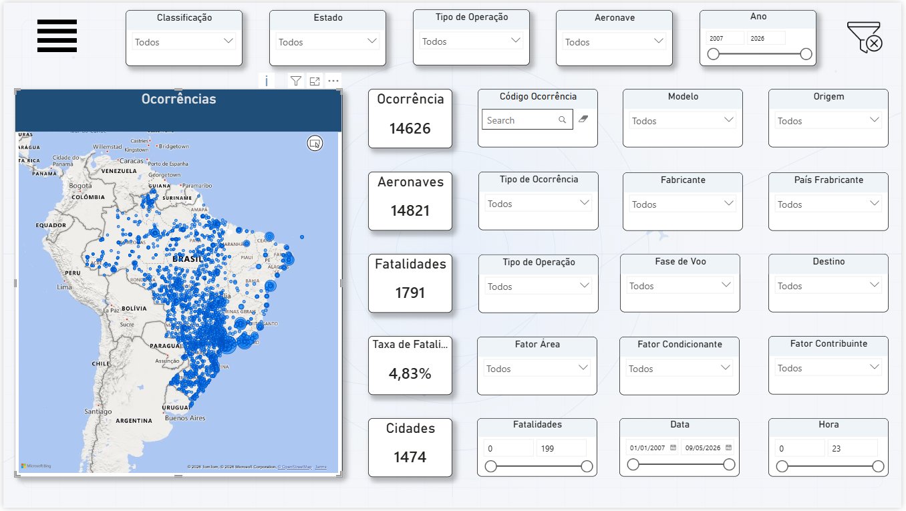

# ✈️ Análise de Acidentes Aeronáuticos no Brasil

Dashboard interativo em Power BI para análise do perfil das ocorrências aeronáuticas registradas no Brasil entre 2007 e 2026.

---

## 📋 Sumário

- [Introdução](#-introdução)
- [Dados](#-dados)
- [Tratamento dos Dados](#-tratamento-dos-dados)
- [Dashboard](#-dashboard)
- [Insights e Recomendações](#-insights-e-recomendações)
- [Conclusão](#-conclusão-qual-é-o-perfil-dos-acidentes-aéreos-no-brasil)

---

## 🎯 Introdução

Este projeto analisa os dados de ocorrências aeronáuticas registradas no Brasil pelo CENIPA (Centro de Investigação e Prevenção de Acidentes Aeronáuticos), abrangendo acidentes, incidentes e incidentes graves. O objetivo é construir um dashboard interativo no Power BI que permita explorar essas ocorrências de forma visual e dinâmica.

**Pergunta central:** *Qual é o perfil dos acidentes aéreos no Brasil?*

Essa pergunta é desdobrada nos eixos:

- **Onde ocorrem?** — Como as ocorrências estão distribuídas geograficamente pelo país, por estado e cidade.
- **O que ocorre e quando ocorre?** — Quais são os tipos de ocorrência mais frequentes, quando elas acontecem (evolução temporal, sazonalidade, horário) e quais são os fatores que as causam.
- **Com quem ocorrem?** — Com quais fabricantes, modelos e tipos de aeronave as ocorrências estão associadas.

**Como a pergunta é respondida:** Cada um dos três eixos corresponde a uma página dedicada no dashboard, permitindo uma exploração focada de cada perspectiva da análise.

---

## 📊 Dados

**Fonte dos dados:** Os dados são provenientes do [CENIPA](https://www.gov.br/cenipa/pt-br) (Centro de Investigação e Prevenção de Acidentes Aeronáuticos), órgão vinculado à Força Aérea Brasileira responsável por investigar e registrar ocorrências aeronáuticas no Brasil. Os dados são públicos e disponibilizados em formato aberto.

**Abrangência:** O dataset cobre ocorrências aeronáuticas registradas no Brasil entre **2007 e 2026**, classificadas em três categorias: Acidente, Incidente e Incidente Grave.

**Estrutura original dos dados:** Os dados originais estão organizados em cinco tabelas, com a tabela `ocorrencia` como entidade central e as demais relacionadas por identificadores textuais de ocorrência em cardinalidade 1:N.

| Tabela | Registros | Colunas | Descrição |
|---|---|---|---|
| `ocorrencia` | 14.626 | 22 | Tabela central com classificação, localização, data/hora, status da investigação e publicação de relatório |
| `aeronave` | 14.822 | 20 | Aeronaves envolvidas: tipo, modelo, fabricante, operação, fase, dano e fatalidades |
| `ocorrencia_tipo` | 15.432 | 3 | Tipos de ocorrência associados, com código ICAO |
| `fator_contribuinte` | 9.106 | 5 | Fatores contribuintes identificados nas investigações |
| `recomendacao` | 2.785 | 9 | Recomendações de segurança emitidas a partir das investigações |

### Dicionário de Dados

<b>ocorrencia</b> — Tabela principal do modelo (clique para expandir)

| Campo | Tipo | Descrição |
|---|---|---|
| codigo_ocorrencia | Texto | Identificador único da ocorrência (chave primária) |
| codigo_ocorrencia1 | Texto | FK para `ocorrencia_tipo` |
| codigo_ocorrencia2 | Texto | FK para `aeronave` |
| codigo_ocorrencia3 | Texto | FK para `fator_contribuinte` |
| codigo_ocorrencia4 | Texto | FK para `recomendacao` |
| ocorrencia_classificacao | Texto | Classificação: Acidente, Incidente ou Incidente Grave |
| ocorrencia_latitude | Numérico | Latitude do local da ocorrência |
| ocorrencia_longitude | Numérico | Longitude do local da ocorrência |
| ocorrencia_cidade | Texto | Cidade onde a ocorrência foi registrada |
| ocorrencia_uf | Texto | Unidade federativa |
| ocorrencia_pais | Texto | País da ocorrência |
| ocorrencia_aerodromo | Texto | Aeródromo associado à ocorrência |
| ocorrencia_dia | Data | Data da ocorrência |
| ocorrencia_hora | Hora | Horário da ocorrência |
| investigacao_aeronave_liberada | Texto | Se a aeronave foi liberada durante a investigação |
| investigacao_status | Texto | Situação da investigação (ex: Finalizada) |
| divulgacao_relatorio_numero | Texto | Número do relatório divulgado |
| divulgacao_relatorio_publicado | Texto | Se houve publicação de relatório |
| divulgacao_dia_publicacao | Data | Data de publicação do relatório |
| total_recomendacoes | Inteiro | Quantidade de recomendações emitidas |
| total_aeronaves_envolvidas | Inteiro | Quantidade de aeronaves envolvidas |
| ocorrencia_saida_pista | Texto | Se houve saída de pista |

<b>aeronave</b> — Aeronaves envolvidas em cada ocorrência (clique para expandir)

| Campo | Tipo | Descrição |
|---|---|---|
| codigo_ocorrencia2 | Texto | FK para `ocorrencia` |
| aeronave_matricula | Texto | Matrícula da aeronave |
| aeronave_operador_categoria | Texto | Categoria do operador |
| aeronave_tipo_veiculo | Texto | Tipo de veículo |
| aeronave_fabricante | Texto | Fabricante da aeronave |
| aeronave_modelo | Texto | Modelo da aeronave |
| aeronave_tipo_icao | Texto | Código ICAO do tipo |
| aeronave_motor_tipo | Texto | Tipo de motor |
| aeronave_motor_quantidade | Inteiro | Quantidade de motores |
| aeronave_pmd | Numérico | Peso máximo de decolagem |
| aeronave_pmd_categoria | Texto | Categoria de PMD |
| aeronave_assentos | Inteiro | Quantidade de assentos |
| aeronave_ano_fabricacao | Inteiro | Ano de fabricação |
| aeronave_pais_fabricante | Texto | País do fabricante |
| aeronave_pais_registro | Texto | País de registro |
| aeronave_registro_categoria | Texto | Categoria de registro |
| aeronave_registro_segmento | Texto | Segmento de registro |
| aeronave_voo_origem | Texto | Origem do voo |
| aeronave_voo_destino | Texto | Destino do voo |
| aeronave_fase_operacao | Texto | Fase da operação no momento da ocorrência |
| aeronave_tipo_operacao | Texto | Tipo de operação (Regular, Privada, Táxi Aéreo, etc.) |
| aeronave_nivel_dano | Texto | Nível de dano (Nenhum, Leve, Substancial, Destruída) |
| aeronave_fatalidades_total | Inteiro | Número de fatalidades |

<b>ocorrencia_tipo</b> — Tipos de ocorrência associados (clique para expandir)

| Campo | Tipo | Descrição |
|---|---|---|
| codigo_ocorrencia1 | Texto | FK para `ocorrencia` |
| ocorrencia_tipo | Texto | Descrição do tipo de ocorrência |
| taxonomia_tipo_icao | Texto | Código padronizado ICAO do tipo |

<b>fator_contribuinte</b> — Fatores identificados nas investigações (clique para expandir)

| Campo | Tipo | Descrição |
|---|---|---|
| codigo_ocorrencia3 | Texto | FK para `ocorrencia` |
| fator_nome | Texto | Nome do fator contribuinte |
| fator_aspecto | Texto | Aspecto do fator |
| fator_condicionante | Texto | Condicionante do fator |
| fator_area | Texto | Área de enquadramento do fator |

<b>recomendacao</b> — Recomendações de segurança emitidas (clique para expandir)

| Campo | Tipo | Descrição |
|---|---|---|
| codigo_ocorrencia4 | Texto | FK para `ocorrencia` |
| recomendacao_numero | Texto | Número identificador da recomendação |
| recomendacao_dia_assinatura | Data | Data de assinatura |
| recomendacao_dia_encaminhamento | Data | Data de encaminhamento |
| recomendacao_dia_feedback | Data | Data de retorno/feedback |
| recomendacao_conteudo | Texto | Texto integral da recomendação |
| recomendacao_status | Texto | Situação da recomendação |
| recomendacao_destinatario_sigla | Texto | Sigla do destinatário |
| recomendacao_destinatario | Texto | Nome completo do destinatário |

---

## 🔧 Tratamento dos Dados

O tratamento dos dados teve como objetivo simplificar a estrutura original, remover campos desnecessários para a análise proposta e criar elementos calculados que viabilizassem os visuais do dashboard.

### Modelo de relacionamento original (CENIPA)

  

### Redução de colunas e tabelas

A tabela `ocorrencia` original possuía 22 colunas. As seguintes foram removidas por não serem utilizadas na análise:

- Chaves estrangeiras duplicadas (`codigo_ocorrencia1`, `2`, `3`, `4`) — unificadas em um único campo `codigo_ocorrencia` para todos os relacionamentos.
- Campos de investigação (`investigacao_aeronave_liberada`, `investigacao_status`).
- Campos de divulgação de relatório (`divulgacao_relatorio_numero`, `divulgacao_relatorio_publicado`, `divulgacao_dia_publicacao`).
- `ocorrencia_aerodromo` e `total_recomendacoes`.

A tabela `aeronave` original possuía 20 colunas. Foram removidas colunas que não contribuíam diretamente para a análise, como `aeronave_matricula`, `aeronave_tipo_icao`, `aeronave_motor_quantidade`, `aeronave_pmd`, `aeronave_pmd_categoria`, `aeronave_assentos`, `aeronave_pais_registro`, `aeronave_registro_categoria` e `aeronave_registro_segmento`.

A tabela `ocorrencia_tipo` teve a coluna `taxonomia_tipo_icao` removida, mantendo apenas o tipo de ocorrência em texto.

A tabela `recomendacao` foi descartada integralmente, por estar fora do escopo analítico do dashboard.

### Colunas calculadas criadas

| Tabela | Coluna | Descrição |
|---|---|---|
| `aeronave` | `Idade Aeronave` | Ano da ocorrência menos ano de fabricação. Valores negativos (dado inconsistente) tratados como branco. |
| `aeronave` | `Trajeto` | Concatenação de origem e destino do voo (ex: "SBSP → SBGR"). |
| `ocorrencia` | `HORA` | Extração da hora inteira (0–23) a partir do campo `ocorrencia_hora`. |
| `ocorrencia` | `UF_Mapa` | Tratamento do nome da UF para compatibilidade com o visual de mapa de formas. |
| `fator_contribuinte` | `fator_area_tratado` | Padronização da área do fator contribuinte. |

### Tabelas auxiliares criadas

| Tabela | Descrição |
|---|---|
| `Calendario` | Dimensão de data com colunas Ano, Mês, Dia, Dia da Semana. Relacionada com `ocorrencia[ocorrencia_dia]`. |
| `Dim_Hora` | Dimensão de hora com granularidade de 1 minuto (1.440 linhas, de 00:00 a 23:59). Relacionada com `ocorrencia[ocorrencia_hora]`. |
| `INDICADOR_CLASSIFICACAO` | Tabela desconectada com os valores do segmentador dinâmico: Ocorrências, Acidentes, Incidentes, Incidentes Graves, Fatalidades (Quantidade) e Fatalidades (Ocorrências). |
| `fabricante_aux` | Tabela de padronização de nomes de fabricantes. |

### Modelo de relacionamento após o tratamento (Power BI)

  

### Estrutura final do modelo

| De | Para | Cardinalidade | Direção do filtro |
|---|---|---|---|
| `aeronave[codigo_ocorrencia]` | `ocorrencia[codigo_ocorrencia]` | N:1 | Bidirecional |
| `fator_contribuinte[codigo_ocorrencia]` | `ocorrencia[codigo_ocorrencia]` | N:1 | Bidirecional |
| `ocorrencia_tipo[codigo_ocorrencia]` | `ocorrencia[codigo_ocorrencia]` | N:1 | Bidirecional |
| `ocorrencia[ocorrencia_dia]` | `Calendario[Data]` | N:1 | Unidirecional |
| `ocorrencia[ocorrencia_hora]` | `Dim_Hora[HoraValor]` | N:1 | Unidirecional |

---

## 📈 Dashboard

O dashboard foi construído como uma narrativa em quatro páginas, onde cada uma aprofunda um eixo da pergunta central do projeto.

### Visão Geral

É a porta de entrada da análise. Apresenta os principais KPIs (total de ocorrências, aeronaves envolvidas, fatalidades, taxa de fatalidade e cidades afetadas), a evolução temporal das ocorrências e a distribuição por classificação, tipo de operação, tipo de aeronave e estado. O objetivo é dar ao usuário um panorama amplo antes de mergulhar nos recortes específicos.

  

### Visão Geográfica

Responde à pergunta **"onde ocorrem?"**. Apresenta a distribuição das ocorrências a nível estadual, permitindo identificar quais regiões do país concentram mais registros e como essa distribuição se comporta conforme o indicador selecionado no segmentador dinâmico.

  

### Ocorrências

Responde às perguntas **"o que ocorre?"** e **"quando ocorrem?"**. Essa página utiliza bookmarks para alternar entre dois recortes: um voltado para o perfil temporal das ocorrências (quando elas acontecem, por ano, mês e horário) e outro voltado para as causas, mostrando os tipos de ocorrência e os fatores contribuintes identificados nas investigações.

**Recorte temporal (quando ocorrem):**

  

**Recorte de causas (o que causa):**

  

### Aeronaves

Responde à pergunta **"com quem ocorrem?"**. Mostra o perfil dos fabricantes e aeronaves envolvidas nas ocorrências, permitindo identificar quais tipos de equipamento, modelos e fabricantes aparecem com mais frequência nos registros.

  

### Mapa

Página extra de exploração livre. Exibe as ocorrências distribuídas pontualmente no mapa brasileiro, oferecendo ao usuário um maior poder de filtragem para investigar recortes específicos por região, cidade ou período.

  

---

Todas as páginas compartilham os mesmos KPIs no topo e são controladas por um **segmentador dinâmico de indicadores**, que permite alternar a análise entre Ocorrências, Acidentes, Incidentes, Incidentes Graves,  Fatalidades(Ocorrências) e Fatalidades(Quantidade) sem sair da página. **Tooltips customizados** com percentuais enriquecem a exploração em cada ponto de dado.

---

## 💡 Insights e Recomendações

### Insight 1 — A aviação comercial é segura; o risco está na aviação geral

A aviação regular (linhas aéreas) registrou 5.575 ocorrências no período, mas apenas 30 acidentes — uma taxa de 0,5%. Em contraste, a aviação privada acumulou 1.281 acidentes em 3.496 ocorrências (36,6%) e concentra 848 fatalidades — quase metade de todas as mortes do período. A aviação agrícola é ainda mais crítica em termos proporcionais: 76,7% das suas ocorrências são acidentes (689 de 898).

O dado mais revelador está nas fatalidades: em 19 anos de dados, a aviação regular brasileira registrou **apenas 3 ocorrências com mortes**, todas amplamente conhecidas:

| Voo | Data | Local | Aeronave | Fatalidades |
|---|---|---|---|---|
| TAM 3054 | 17/07/2007 | São Paulo (Congonhas), SP | Airbus A320 | 199 |
| Noar 4896 | 13/07/2011 | Recife, PE | LET L-410 | 16 |
| VoePass 2283 | 09/08/2024 | Vinhedo, SP | ATR 72-500 | 62 |

Somadas, essas três tragédias respondem por 277 mortes — enquanto as demais 1.514 fatalidades do período estão pulverizadas em centenas de acidentes menores da aviação geral, que raramente ganham manchete nacional. O risco estatístico de voar em linha aérea no Brasil é baixíssimo; o problema estrutural da segurança aérea brasileira está nos pequenos aviões privados e agrícolas.

> **Recomendação:** Direcionar os esforços de fiscalização, formação e campanhas de segurança prioritariamente para a aviação privada, agrícola e experimental, onde o risco real está concentrado. Para o passageiro comum, os dados confirmam: voar em linha aérea regular no Brasil é extremamente seguro.

### Insight 2 — O salto de ocorrências pós-2023 indica melhora no reporte, não piora na segurança

As ocorrências saltaram de 616 em 2022 para 2.705 em 2024 (4,4x), mas o número de acidentes permaneceu estável (entre 138 e 175 por ano). O crescimento veio de incidentes de baixa gravidade: colisões com aves saltaram de 439 registros acumulados (2007–2022) para 1.973 em apenas três anos, e falhas de sistema/componente dobraram. Isso caracteriza um fortalecimento da cultura de reporte — mais eventos menores sendo registrados — e não uma degradação da segurança aérea.

> **Recomendação:** Tratar o aumento de registros como um ativo: a base maior de incidentes permite identificar riscos emergentes antes que se tornem acidentes. Vale investir em programas de gestão de risco de fauna (aves) nos aeródromos, tema que se tornou o segundo tipo de ocorrência mais frequente do país.

### Insight 3 — O fator humano é a causa dominante dos acidentes

Entre os fatores contribuintes identificados nas investigações, os líderes são todos humanos: julgamento de pilotagem (1.158 ocorrências), aplicação de comandos (822), supervisão gerencial (679), planejamento de voo (642) e atitude (529). A manutenção da aeronave — fator material — aparece com 544 ocorrências, abaixo dos principais fatores operacionais.

> **Recomendação:** Priorizar treinamento de tomada de decisão (ADM — Aeronautical Decision Making), gerenciamento de risco pré-voo e disciplina operacional na formação e reciclagem de pilotos, especialmente na aviação geral, onde a supervisão é menor.

### Insight 4 — Pouso e decolagem concentram ocorrências, mas cruzeiro e manobra matam mais

As fases de pouso (2.865) e decolagem (2.521) lideram em número de ocorrências. Porém, a fase de cruzeiro, com menos ocorrências (2.334), concentra o maior número de fatalidades: 461. Mais dramático ainda é a fase de manobra: apenas 432 ocorrências, mas 169 mortes — uma letalidade proporcional altíssima, associada a voos de baixa altura (típicos da operação agrícola e de demonstrações).

> **Recomendação:** Reforçar procedimentos e treinamento para operações de baixa altura e manobras, e investir em conscientização sobre gerenciamento de emergências em cruzeiro (falha de motor em voo registra 1.134 ocorrências), onde a chance de um desfecho fatal é maior.

### Insight 5 — Aeronaves mais velhas se envolvem em ocorrências mais graves

A idade média das aeronaves envolvidas cresce conforme a gravidade: 17,1 anos nos incidentes, 25,4 nos acidentes e 26,4 nos incidentes graves — uma diferença de quase 9 anos entre o evento leve e o grave. O envelhecimento da frota de aviação geral brasileira é um fator de risco mensurável nos dados.

> **Recomendação:** Intensificar os requisitos de inspeção e manutenção para aeronaves com mais de 20 anos, especialmente na aviação privada e agrícola, onde frota antiga e operação de risco se sobrepõem.

---

## 🏁 Conclusão: qual é o perfil dos acidentes aéreos no Brasil?

O acidente aéreo típico brasileiro **não** acontece com um avião de linha aérea. Ele acontece com uma **aeronave de pequeno porte, com cerca de 25 anos de idade**, operada na **aviação privada, agrícola ou de instrução**, frequentemente no **interior do país** — estados como Mato Grosso, onde quase metade das ocorrências são acidentes, ilustram o padrão. A causa raramente é uma única falha mecânica: o **fator humano domina**, com julgamento de pilotagem, planejamento de voo deficiente e supervisão inadequada liderando as investigações. As fases críticas são **pouso e decolagem** em volume, mas é em **cruzeiro e manobras de baixa altura** que os desfechos fatais se concentram — em média, cada acidente fatal mata 2,5 pessoas.

Do outro lado, a aviação comercial regular brasileira apresenta indicadores de segurança excelentes: milhares de ocorrências registradas, mas taxa de acidente de 0,5% e participação mínima nas fatalidades. E o aparente "crescimento" das ocorrências desde 2023 é, na verdade, um sinal de maturidade: o país está reportando mais e melhor, criando a base de dados necessária para prevenir os acidentes de amanhã.

---

## 🛠️ Tecnologias utilizadas

- **Power BI Desktop** — Visualização
- **Power Query** — tratamento e transformação dos dados
- **DAX** — medidas dinâmicas, tooltips customizados e colunas calculadas

---

